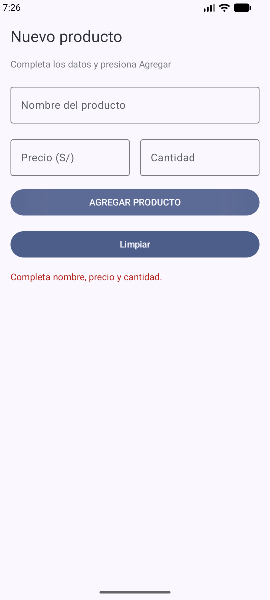
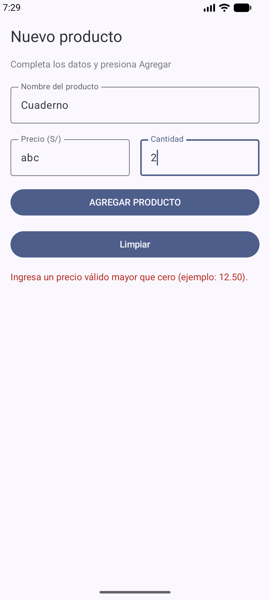
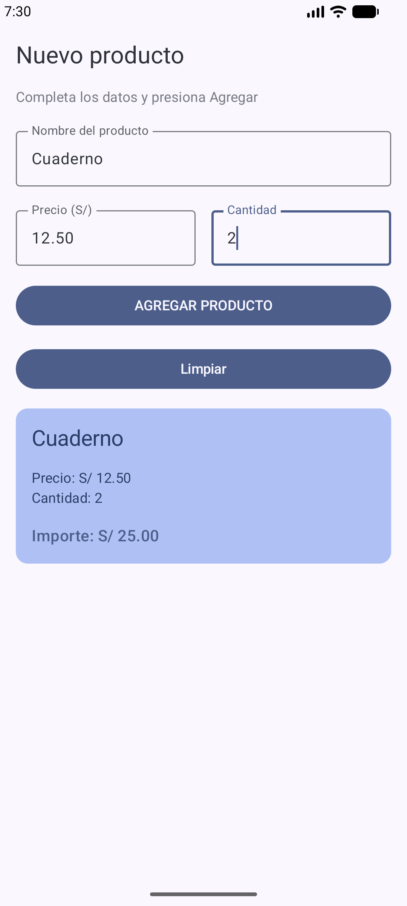

# Laboratorio 03 Registro de Producto

**Estudiante:** Jery Becerra Ninaquispe

**Proyecto:** `SEMANA3/Lab 3`

**Parte B:** rama `mejora-ia`, creada desde `main` en `c84a921`.

Aplicación Android con Kotlin, Jetpack Compose y Material 3. Permite ingresar nombre, precio y cantidad; al presionar **AGREGAR PRODUCTO**, muestra una Card con el importe calculado y dos decimales. La Parte B incorpora validación y un botón **Limpiar**.

La documentación y las capturas originales de la Parte A se conservan en [el README de SEMANA3](../README.md). El desarrollo de esta mejora se realiza exclusivamente en `mejora-ia`.

## Mejora con IA

Se utilizó **Gemini Flash-Lite desde su interfaz web** para generar B1. Codex preparó y envió la petición, aplicó el código, ejecutó las pruebas, implementó las correcciones B2 y preparó la documentación. Las correcciones B2 son asistidas por IA; no se presentan como correcciones escritas manualmente por el estudiante. La revisión personal y la explicación oral de las decisiones corresponden al estudiante, tal como pide la guía.

| Prompt que usé | Qué generó Gemini | Qué acepté o corregí (y por qué) |
| --- | --- | --- |
| En `PantallaRegistro`, validar nombre, precio y cantidad vacíos o con espacios al pulsar AGREGAR; mostrar error rojo en lugar de la Card; agregar Limpiar para vaciar campos y ocultar error y resumen. Conservar estado, diseño, cálculo, dos decimales y configuración del proyecto. | Un estado `mostrarError`, validación con `isBlank()`, error con `MaterialTheme.colorScheme.error` y un botón Limpiar que reinicia los tres campos y los estados. | B1 conserva el código de Gemini. Se aceptan la validación de vacíos, el uso del color de error del tema y la limpieza completa. El [prompt exacto](docs/prompt-gemini.md) incluye el código original enviado. |
| La petición inicial conservó `toDoubleOrNull` / `toIntOrNull` y Elvis; después se revisó el caso precio con letras que exige la guía. | Si todos los campos estaban completos, permitía mostrar la Card aunque `abc` se convirtiera en cero. | En B2, Codex agregó mensajes específicos y rechaza precio no numérico, no finito o no positivo, y cantidad que no sea un entero positivo representable. Así se evita registrar datos inválidos como cero. También se rechaza un importe que desborde el rango de `Double`. |
| Se revisó qué sucede al editar un producto después de pulsar AGREGAR. No se envió un segundo prompt a Gemini. | La Card seguía visible y cambiaba con cada edición, sin pasar nuevamente por la validación. | En B2, Codex agregó `ocultarResultado()` y la invoca en cada `onValueChange` y en Limpiar. Se evita mostrar un resumen de datos aún no validados y se retira el error anterior mientras se corrige la entrada. Se usa `trim()` para aceptar espacios alrededor de datos válidos. |

## Comportamiento y decisiones

- Un campo vacío o compuesto solo por espacios produce un error rojo, sin Card.
- El precio debe ser un número finito mayor que cero. El mensaje muestra `12.50` como ejemplo de separador decimal.
- La cantidad debe ser un entero mayor que cero dentro del rango de `Int`.
- Con `Cuaderno`, precio `12.50` y cantidad `2`, el importe es `S/ 25.00` (el separador mostrado depende de la configuración regional, como en la Parte A).
- Al editar un campo, se ocultan tanto el resumen como el error anterior. Hay que volver a presionar AGREGAR para validar.
- Limpiar vacía nombre, precio y cantidad y oculta los resultados. No elimina información de ningún servidor: este laboratorio solo mantiene estado en memoria.
- Se conservan `remember`, `mutableStateOf`, la fila de precio y cantidad con `weight(1f)`, los espacios de `16.dp`, el tema y el formato de dos decimales.

## Capturas de la mejora

Capturas reales de la aplicación ejecutada en el emulador `Medium_Phone`, Android API 37.

### Campos vacíos



### Precio con letras



### Producto válido



## Verificación

B1 compiló y se ejecutó en el emulador. Se ejecutaron seis pruebas de diagnóstico: vacíos, espacios, producto válido, limpieza del resumen, limpieza del error y reproducción de la conversión de `abc` a cero. Ese último caso identifica el defecto que corrige B2.

La versión B2 incluye [13 pruebas instrumentadas](app/src/androidTest/java/com/becerra/lab03registroproducto/RegistroProductoTest.kt), todas aprobadas: los casos principales de registro y limpieza, cada campo obligatorio, números inválidos, edición posterior al registro, recuperación de errores, espacios alrededor de valores válidos y desbordamiento del importe. La compilación y la prueba unitaria de la plantilla también pasaron. Lint terminó con cero errores y 13 advertencias en el formato regional, dependencias, manifiesto y recursos que se conservaron del proyecto base.

Desde esta carpeta, con Java y el SDK Android configurados y un emulador iniciado:

```powershell
.\gradlew.bat assembleDebug testDebugUnitTest lintDebug connectedDebugAndroidTest "-Pandroid.testInstrumentationRunnerArguments.class=com.becerra.lab03registroproducto.RegistroProductoTest"
```

Las pruebas instrumentadas también generan capturas en `/data/local/tmp/lab03-*.png` del emulador, para que sobrevivan a la limpieza de la aplicación de prueba. No se modificaron las versiones de Gradle, las dependencias ni el proyecto de préstamos ubicado en otra carpeta de SEMANA3.

## Historial de la Parte B

1. **B1:** `Aplica mejora generada con IA: validacion y boton limpiar`. Código original de Gemini después de compilarlo y ejecutarlo.
2. **B2:** `Corrige codigo de la IA: rechaza numeros invalidos y oculta resumen al editar`. Correcciones asistidas por Codex y pruebas que permiten verificarlas.
3. **B3:** `Documenta prompts y decisiones en README`. Tabla de decisiones, prompt exacto y capturas del emulador.

Los commits conservan sus horas reales. Para ver únicamente el trabajo de esta parte:

```powershell
git log --oneline main..mejora-ia
git diff main...mejora-ia -- "SEMANA3/Lab 3"
```

## Puntos para la defensa oral

`isBlank()` detecta tanto una cadena vacía como una que contiene solo espacios. `toDoubleOrNull()` y `toIntOrNull()` devuelven `null` cuando no pueden convertir el texto; en B2 se revisa ese resultado antes de permitir la Card. El operador Elvis se conserva como respaldo en la visualización, pero no sustituye la validación.

`mensajeError == null` indica que la validación no encontró errores. `mostrarResumen` solo se activa después de esa validación; cualquier edición lo desactiva. Limpiar restablece los campos y llama a la misma función de reinicio.

`remember` conserva los estados entre recomposiciones mientras el composable permanece en la composición. Si se crea `mutableStateOf("")` sin `remember` dentro de la función, se vuelve a crear en cada recomposición y se pierde el valor ingresado. Una variable normal tampoco notifica cambios a Compose. `remember` por sí solo no garantiza conservar los datos al recrearse la actividad.
