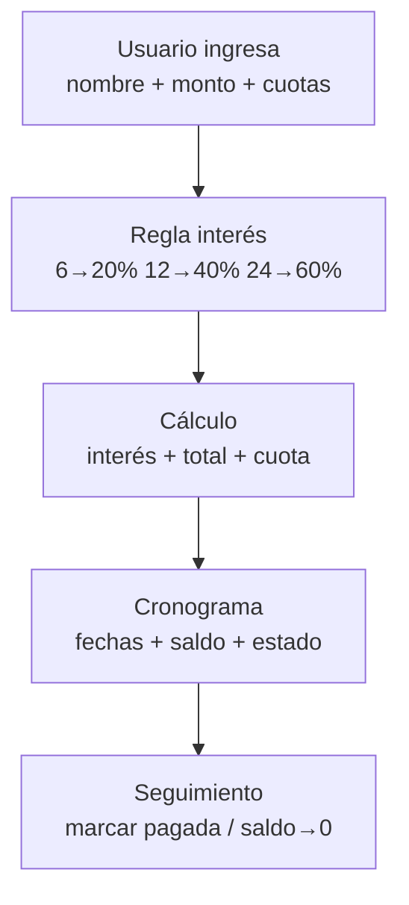

# 01 — Visión General

## Objetivo (Guía §1, §17)
Aplicación móvil **Kotlin** para gestionar préstamos y calcular cronograma de pagos. No es un banco completo, solo flujo: `datos → interés → total → cuota → cronograma → saldo`.

## Stakeholders
- **Usuario / Cliente:** ingresa nombre, monto, elige cuotas.
- **Sistema:** aplica regla de interés, calcula, genera fechas, descuenta saldo al pagar.

## Flujo completo (Guía §12)

## Capas (Guía §11)
- `domain/model`: [[02-Dominio/01-Modelos]]
- `domain/calculator`: [[02-Dominio/02-Calculadora]]
- `data`: Repository en memoria (extensible a Room)
- `ui`: Compose + Navigation → [[03-UI/02-Pantallas]]
- `ui/viewmodel`: Estado y orquestación → [[03-UI/03-ViewModel]]

## Stack elegido y por qué
| Decisión | Alternativa descartada | Razón |
|---|---|---|
| Jetpack Compose + Material3 | XML | Más declarativo, recomendado por guía §14 "no asumir", pero Compose es estándar 2026 |
| Navigation Compose | Nav manual | Tipado, testable |
| Room (opcional) | SQLite crudo / Firebase | Guía §14 dice no asumir BD; se deja in-memory + wrapper Room listo |
| `java.time.LocalDate` | kotlinx-datetime solo | Compatible Compose, fácil test |
| MVVM + StateFlow | MVP | Unidireccional, lifecycle-aware |

Ver también [[01-Arquitectura/03-Decisiones]] y [[01-Arquitectura/02-Diagrama-Capas]].
