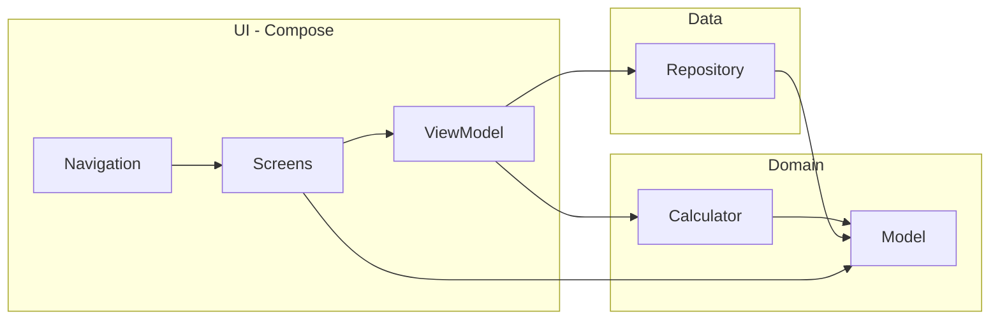

# 02 — Diagrama de Capas

## Estructura de paquetes
```
com.prestamos.sistema
├── domain
│   ├── model        // Cliente, Prestamo, Cuota, EstadoCuota
│   └── calculator   // CalculadoraPrestamo (regla + fórmulas)
├── data             // PrestamoRepository (StateFlow, CRUD)
├── ui
│   ├── theme        // SistemaPrestamosTheme
│   ├── navigation   // Screen sealed class
│   ├── screens      // Registro / Resumen / Cronograma / Historial
│   └── viewmodel    // PrestamoViewModel
└── MainActivity     // NavHost
```

## Dependencias


## Archivos clave y líneas
- `domain/model/Cliente.kt:1` — validación nombre no vacío
- `domain/model/Cuota.kt:1` — `EstadoCuota {PENDIENTE,PAGADA}` + `fechaVencimiento: LocalDate`
- `domain/model/Prestamo.kt:1` — `saldoPendiente`, `totalPagado` derivados del cronograma
- `domain/calculator/CalculadoraPrestamo.kt:1` — regla `6→0.20, 12→0.40, 24→0.60`, fórmulas §8, generación mensual `plusMonths`
- `data/PrestamoRepository.kt:1` — `MutableStateFlow<List<Prestamo>>`
- `ui/viewmodel/PrestamoViewModel.kt:1` — orquesta validación→cálculo→guardado→toggle cuota
- `MainActivity.kt:1` — `NavHost` con 4 destinos

## Persistencia
Actual: **in-memory** (`StateFlow`). Si el profesor exige BD (§14), cambiar `PrestamoRepository` por Room `Dao` sin tocar UI (interfaz ya aislada). Ver [[01-Arquitectura/03-Decisiones#Persistencia]].

## Enlaces
- [[02-Dominio/01-Modelos]]
- [[03-UI/01-Navegacion]]
- [[01-Arquitectura/04-Verificacion-Guia]]
