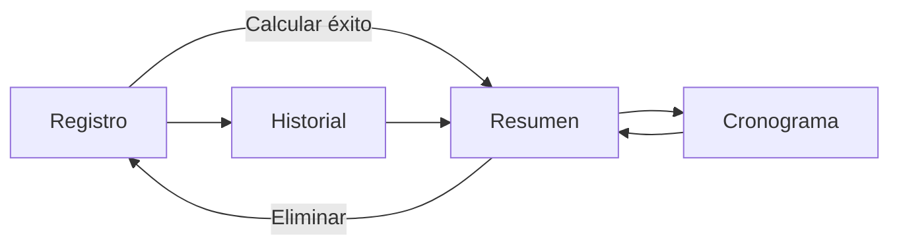

# Navegación

**Archivo:** `ui/navigation/NavGraph.kt:1` + `MainActivity.kt:1`

## Grafo

## Rutas (sealed class Screen)
- `registro` — start
- `resumen/{prestamoId}` — `createRoute(id)`
- `cronograma/{prestamoId}`
- `historial`

## Estado compartido
`PrestamoViewModel` es `viewModel()` scoped a `MainActivity` → sobrevive a navegación. `prestamosFlow: StateFlow<List<Prestamo>>` + `uiState.prestamoActual`.

## Argumentos
`backStack.arguments.getString("prestamoId")?.toLongOrNull()` — lookup en `historial` o `prestamoActual`.

Ver [[03-UI/02-Pantallas]] y [[03-UI/03-ViewModel]].
