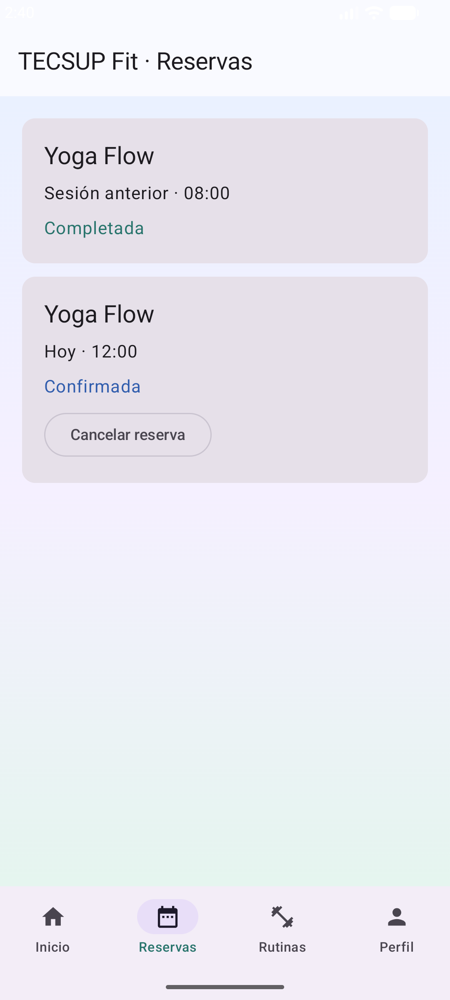
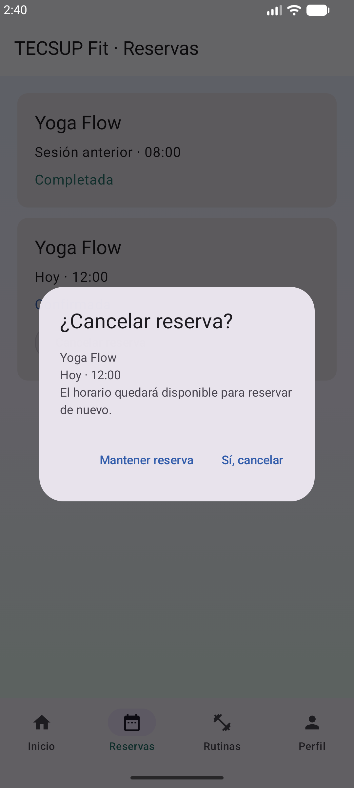
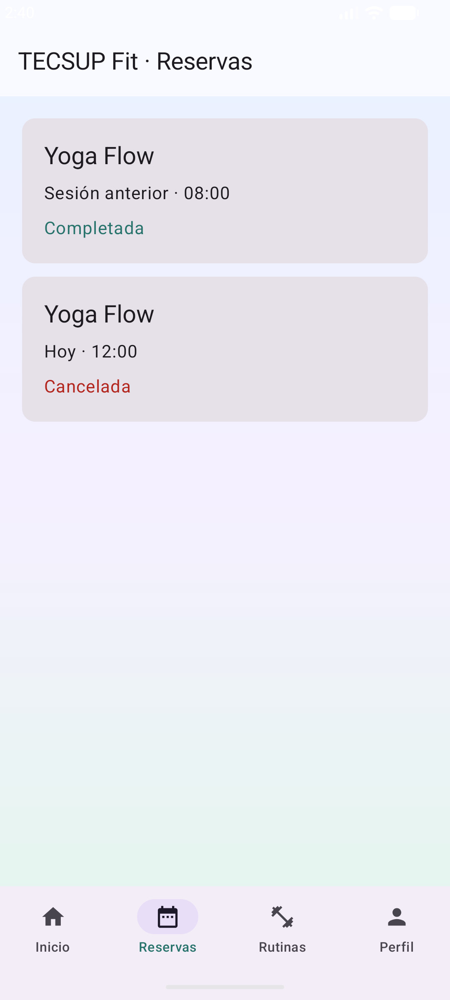

# Verificación de la base · 23/09/2026

## Resultado comprobado

- TECSUP Fit: `assembleDebug` correcto.
- `testDebugUnitTest`: 4 pruebas, 0 fallos (filtros, valores inválidos, duplicados y liberación de horario cancelado).
- `connectedDebugAndroidTest`: 5 pruebas, 0 fallos, 0 omitidas, en Medium_Phone con Android 17 (imagen beta instalada en el PC).
- `lintDebug`: 0 errores, 4 advertencias informativas; no se ocultaron comprobaciones.
- Lab05 después del traslado y de completar Gradle: `assembleDebug` correcto.

## Flujos de interfaz comprobados

1. Reserva completa con Scaffold, selección obligatoria y resumen.
2. Misma reserva sin Scaffold, conservando navegación.
3. Inicio sin navegación, conservando barras y filtros.
4. Reserva usando Column y Row en lugar de listas Lazy en Inicio.
5. Cambio entre las cuatro pestañas y datos de Perfil.

## Correcciones durante la validación

- Se alineó `concurrent-futures` a 1.2.0 para resolver restricciones de versiones del runtime de pruebas.
- Se declaró Espresso 3.7.0; la versión transitiva anterior fallaba al inicializar la inyección de eventos en Android 17.
- Se retiró un atributo XML de barra de navegación que exigía API 27; la app conserva minSdk 24 y usa `enableEdgeToEdge`.
- Se corrigió el escape de la ruta local al SDK en `local.properties` (archivo excluido de Git).
- Se amplió a 2 GB la memoria de Gradle de Lab05 después de un fallo por memoria insuficiente.
- Se excluyeron los volcados de memoria JVM del control de versiones.

## Alcance

Las pruebas ejecutan las alternativas ya implementadas; no equivalen a verificar cualquier edición manual futura del estudiante. Después de retirar funciones físicamente, se debe volver a compilar y probar. No se ha probado cada versión Android entre API 24 y 37. Los datos son locales de demostración y no se guardan permanentemente.

Los reportes completos se generan localmente en `app/build/reports/`; no se suben archivos de compilación al repositorio.

## Resultado final de mejora-ia

- `assembleDebug`, `testDebugUnitTest`, `connectedDebugAndroidTest` y `lintDebug`: BUILD SUCCESSFUL.
- 5 pruebas de lógica: 0 fallos.
- 7 pruebas de interfaz: 0 fallos, 0 omitidas.
- Se verificaron mantener reserva, confirmar cancelación, conservar historial, reservar nuevamente el horario y restaurar el estado guardado.
- Lint: 0 errores y 4 advertencias sobre versiones de dependencias o el SDK de pruebas; no impiden compilar.
- Lab05 recompilado tras integrar las actualizaciones remotas de sus pantallas: BUILD SUCCESSFUL. Conserva una advertencia de API obsoleta en el color de barra de estado del tema existente.

Capturas reales del emulador:

| Reservas | Confirmación para cancelar | Historial tras cancelar |
|---|---|---|
|  |  |  |
